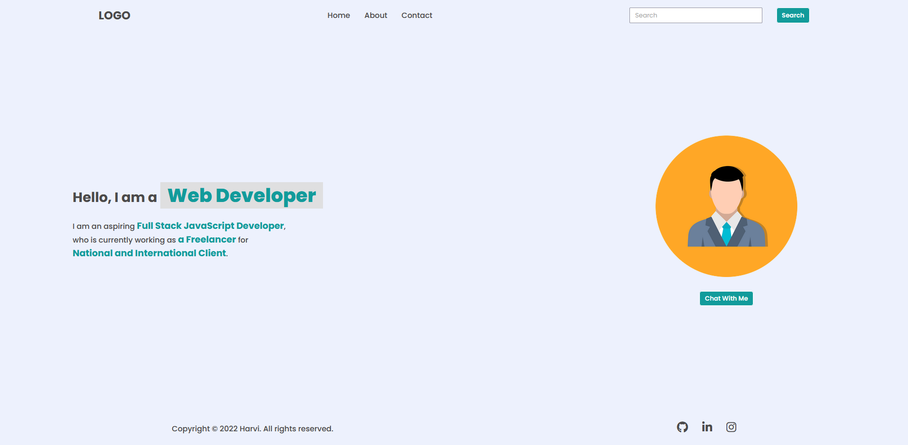
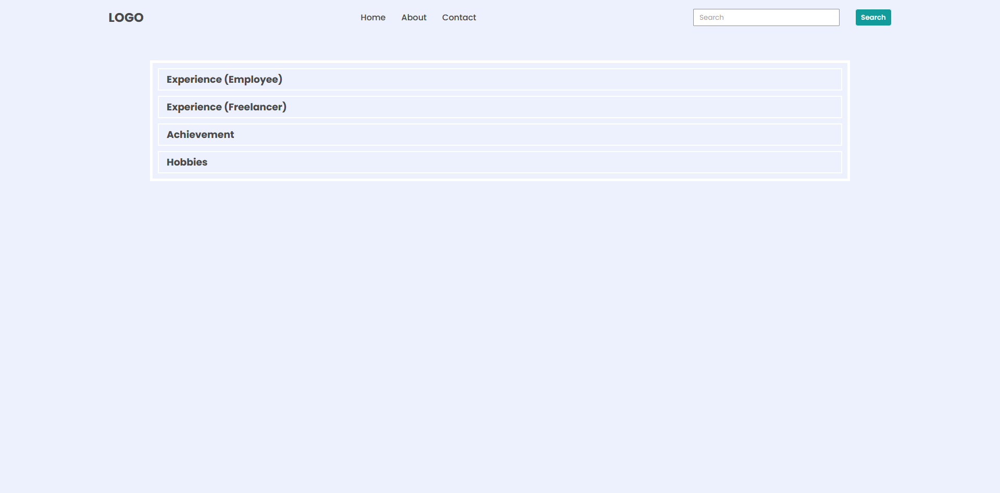
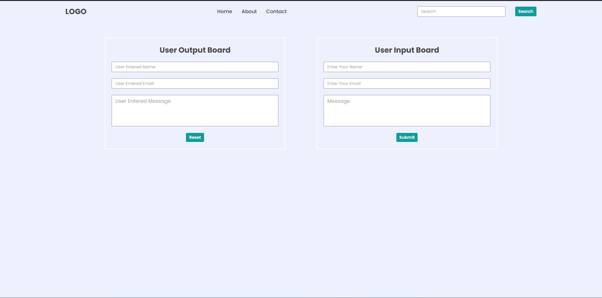

# DOM Project - 1

---

## Original Output


## Task - 1

### Solution
```javascript
const ul = document.querySelector('ul');
const link = document.createElement('a');
link.href = '#';
link.textContent = 'Hire Me';
const li = document.createElement('li');
li.appendChild(link);
ul.appendChild(li);
```
### After Update


## Task - 2

### Solution
```javascript
const input = document.querySelector('.search-field > input');
input.setAttribute('placeholder', 'Search My Project');
```
### After Update


## Task - 3

### Solution
```javascript
const p = document.querySelector('.hero-left-section > p');
p.children[1].textContent = 'an Employee';
p.lastElementChild.textContent = 'iNeuron Intelligence Pvt Ltd';
```
### After Update


## Task - 4

### Solution
```javascript
const img = document.querySelector('.hero-right-section > img');
img.setAttribute('src', './avatar1.png');
```
### After Update


## Task - 5

### Solution
```javascript
const btnContainer = document.querySelector('.hero-right-section-btns');
const btn = document.createElement('button');
btn.textContent = 'Support Me';
btnContainer.appendChild(btn);
```
### After Update


# DOM Project - 2

---

## Original Output


## Task - 1

### Solution
```javascript
const paras = document.querySelectorAll('p');
const titles = document.querySelectorAll('h3');

paras[2].style.display = 'block';
paras[3].style.display = 'block';

titles[2].style.backgroundColor = '#DADAF8';
titles[3].style.backgroundColor = '#DADAF8';
```
### After Update


## Task - 2

### Solution
```javascript
const accordianWrapper = document.querySelector('.accordian-wrapper');
const accordianDiv = document.createElement('div');
accordianDiv.classList.add('accordian');

const h3 = document.createElement('h3');
h3.textContent = 'Skills';
h3.style.backgroundColor = '#DADAF8';

const p = document.createElement('p');
p.textContent = 'I posses a very good command over the Full Stack Development technologies like MERN which can be seen in my work over the Github.';
p.style.display = 'block';

accordianDiv.appendChild(h3);
accordianDiv.appendChild(p);

accordianWrapper.appendChild(accordianDiv);
```
### After Update


# DOM Project - 3

---

## Original Output


## Task - 1

### Solution
```javascript
const inputName = document.querySelector('.userName');
const inputEmail = document.querySelector('.userEmail');
const inputMessage = document.querySelector('.userMessage');
const submit = document.querySelector("button[type='submit']");

const outputName = document.querySelector('.enterName');
const outputEmail = document.querySelector('.enterMail');
const outputMessage = document.querySelector('.enterMessage');
const reset = document.querySelector("button[type='reset']");

submit.addEventListener('click', (e) => {
    e.preventDefault();
    outputName.value = inputName.value;
    outputEmail.value = inputEmail.value;
    outputMessage.value = inputMessage.value;
})

reset.addEventListener('click', (e) => {
    e.preventDefault();
    outputName.value = '';
    outputEmail.value = '';
    outputMessage.value = '';
});
```
### After Update
