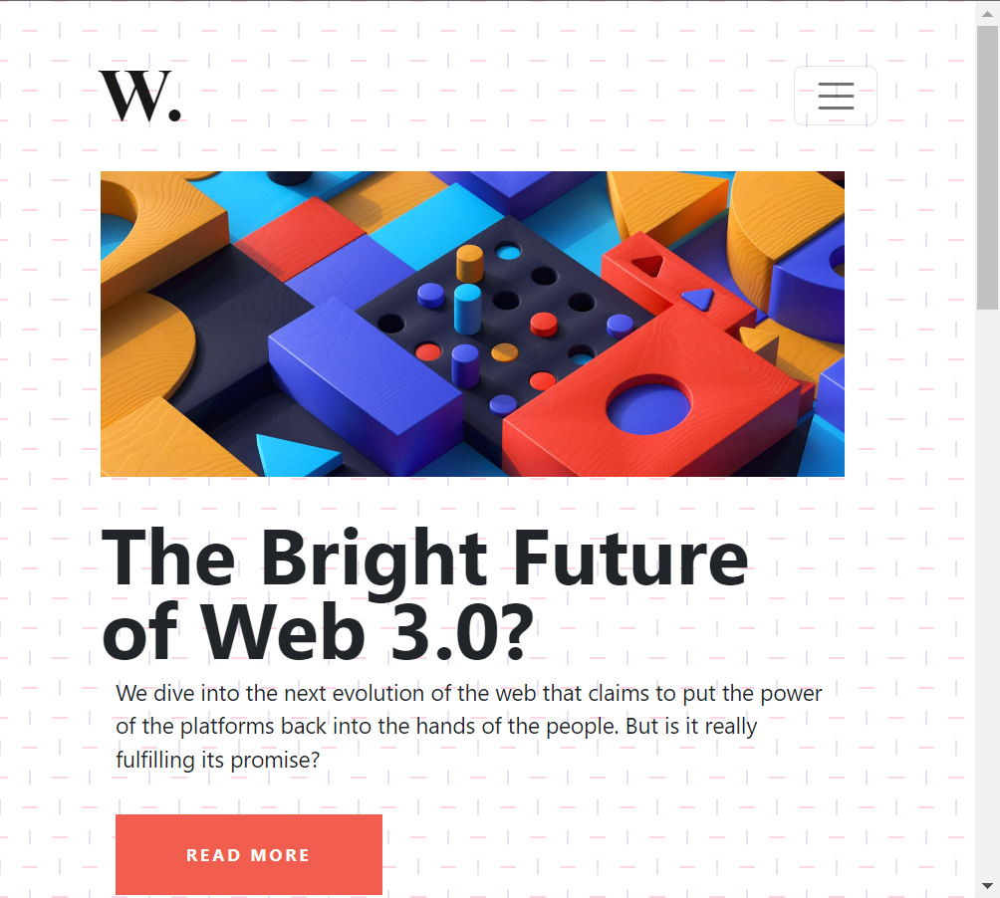

# DOM Project - 8

---

## Task - 1

### Before


### Output


### Solution
```javascript
// News Scrollbar
const aside = document.querySelector('.first-row > aside');
const hrLine = document.createElement('hr');
const customH2 = document.createElement('h2');
const customP = document.createElement('p');

aside.style.overflowY = 'scroll';
hrLine.classList.add('hr-line');
customH2.classList.add('new-head');
customH2.textContent = 'This is My Custom Headline';
customP.classList.add('new-p');
customP.textContent = 'Lorem ipsum dolor sit amet, consectetur adipiscing elit. Maecenas vitae dolor accumsan, ullamcorper sapien non, vulputate eros. Phasellus mollis ultrices leo et tincidunt.'

aside.appendChild(hrLine);
aside.appendChild(customH2);
aside.appendChild(customP);
```

## Task - 2

### Before


### Output


### Solution
```javascript
// Remove Background
const body = document.querySelector('body');
body.style.backgroundImage = 'none';
```

## Task - 3

### Before


### Output


### Solution
```javascript
// Hameburger Menu
const navToggle = document.querySelector('.navbar-toggler');
const navbar = document.querySelector('#navbarTogglerDemo01');

navToggle.addEventListener('click', (e) => {
    e.preventDefault();
    navbar.classList.toggle('collapse');
})
```